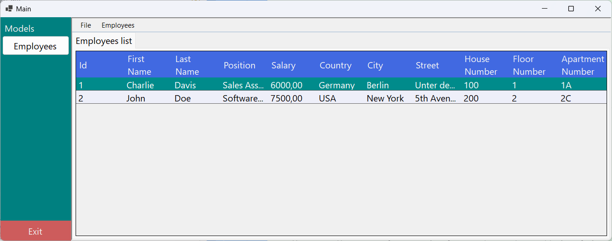
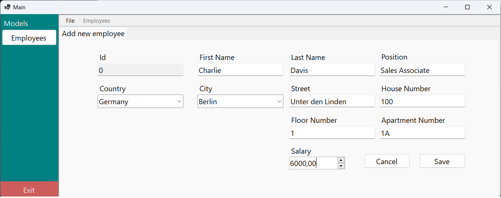
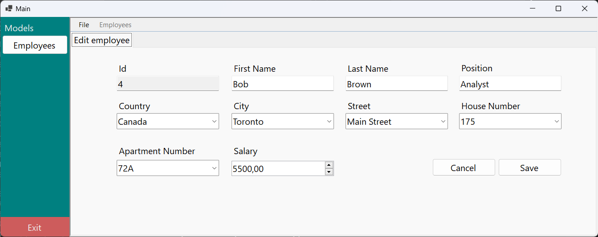

# Employee Management System

This system is designed to streamline employee management, allowing users to add, edit, delete, and view employee details through a user-friendly interface. The system leverages dropdown menus to handle country, city, street, house and apartment selection, ensuring data consistency and flexibility for users. The design follows the **Model-View-Presenter (MVP)** pattern to maintain separation of concerns between the UI and business logic.

## Key Features

- **Employee Management**: Manage employees by adding, editing, and deleting records with fields such as name, position, salary, and address details (country, city, street, house and apartment).
- **Data Validation**: Built-in validation for ensuring the accuracy of employee data such as first name, last name, salary, position and location before submission.
- **MVP Architecture**: The project follows the **MVP pattern**, enhancing testability and maintainability by separating concerns between data models and presentation logic.
- **Address Management**: In addition to basic employee details, users can manage extended address information through dropdown lists, including country, city, street, house, and apartment number.

## Technologies Used

- **C# / .NET Framework**: Core language and framework used for developing the application.
- **WinForms**: Provides a responsive and interactive graphical user interface.
- **MVP Architecture**: Helps in organizing the code and making the application scalable and easy to maintain.
- **SQL Database**: Stores employee information, including relationships between countries, cities, and addresses for easy retrieval and manipulation.

**Note**: The dropdown lists provide a reference-based selection for fields such as country, city, and other address details, helping users navigate and fill in employee information efficiently beyond just name, salary, and position.
