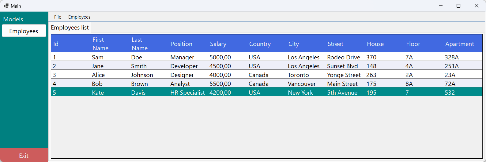

# Employee Management System

This Employee Management System allows for easy management of employees, including adding, editing, and deleting employees, with support for country and city selection. The system includes several key features such as event-driven handling of user inputs and a responsive UI built using WinForms. The project follows the MVP (Model-View-Presenter) pattern.

## Features

- **Employee Management**: Add, edit, and delete employees with fields like name, position, salary, and address details.
- **Country and City Selection**: Users can select a country from a dropdown list, which then loads the corresponding cities. If a required country or city is missing, users can add new ones.
- **Validation**: Built-in validation for employee details to ensure accurate data entry.
- **Event-Driven Design**: The UI reacts to user actions using events like `AddNewEvent`, `EditEvent`, `DeleteEvent`, and more.
- **MVP Architecture**: Follows the Model-View-Presenter architecture to separate concerns, improving testability and maintainability.

## Technologies Used

- **C# / .NET Framework**: The main language used for building the Windows Forms application.
- **WinForms**: For building the graphical user interface.
- **MVP Pattern**: Ensures a clear separation of concerns between the UI and business logic.
- **SQL**: Database connectivity for retrieving and storing employee, country, and city data.

